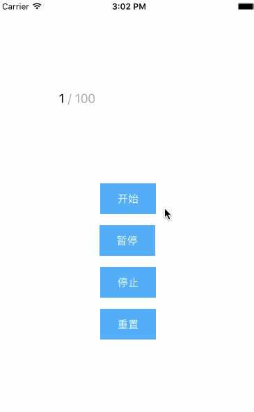

# ACLabelCounting
Adds animated counting to UILabel for swift



## Installation

To integrate ACLabelCounting into your Xcode project using CocoaPods, specify it in your Podfile:

```swift

pod 'ACLabelCounting'

```

## Usage
初始化一个 ACLabelCounting 对象就可以直接调用 `count` 方法。
普通的从 0 到 100 的计数动画，动画是线性的，数据类型是整数类型，没有格式化字符串。  

``` swift
label.count(to: 100)
```
从 10 到 100 的计数动画，持续时间是 5 秒钟，动画类型是渐入效果，数据类型是 .Double 类型。

``` swift
label.count(from: 10,
            to: 100,
            duration: 5,
            animationType: .EaseIn,
		    dataType: .Double)
```
从 0 到 100 的计数动画，持续时间是 5 秒钟，动画类型是渐出效果，数据类型是 .Int 类型。字符串格式化是在字符串后面增加一个 `%`。

``` swift
label.count(from: 0,
            to: 100,
            duration: 5,
            animationType: .EaseOut,
            dataType: .Int) { txt in
                return "\(txt) %"
        }
```
从 0 到 100 的计数动画，持续时间是 5 秒钟，动画类型是渐 入效果，数据类型是 .Int 类型。字符串格式化就是在字符串有面加上 `／ 100` ，它颜色是亮灰色的。

``` swift
label.count(from: 0,
                    to: 100,
                    duration: 5,
                    animationType: .EaseIn,
                    dataType: .Int) { text -> NSAttributedString in
                        let appandString = " / 100"
                        let string = "\(text)\(appandString)"
                        let range = (string as NSString).range(of: appandString)
                        
                        let attributedString = NSMutableAttributedString(string: string)
                        attributedString.addAttribute(NSForegroundColorAttributeName,
                                                      value: UIColor.lightGray,
                                                      range: range)
                        return attributedString;
        }

```
暂时只有这么的多的功能，如果你还想增加更强大的功能或者效果，欢迎发 issue。
 
## Source Analytics

``` swift
enum ACLabelCountingDataType {
    case Int
    case Double
}
```
数据类型是 Int 或者 Double。

``` swift
enum ACLabelCountingAnimationType {
    case None
    case Liner
    case EaseIn
    case EaseOut
    case EaseInOut
}
```
计数动画效果的类型分别是：没有效果（和线性效果一样）、线性效果、渐入效果、渐出效果、渐入渐出效果。他们分别对应的函数是：

``` swift
extension ACLabelCounting {
    func liner(progress: Double, totle: Double) -> Double {
        return progress / totle
    }
    
    func easeIn(progress: Double, totle: Double) -> Double {
        return pow(progress / totle, 3)
    }
    
    func easeOut(progress: Double, totle: Double) -> Double {
        let t = progress / totle
        return  1 - pow(1 - t, 3)
    }
    
    func easeInOut(progress: Double, totle: Double) -> Double {
        let t = progress / totle
        return t < 0.5 ? 4 * t * t * t : (t - 1) * (2 * t - 2) * (2 * t - 2) + 1
    }
}
```
`progress` 表示计数的进度，`totle` 表示 fromValue 到 toValue 所设置的时间。

ACLabelCountting 有 5 个基本操作分别是：

- start()
- pause()
- restore()
- stop()
- reset()

关键使用 `CADisplayLink` 定时器以每秒 35 次的频率执行 `updateNumber` 任务，并且以 .commonModes 模式加入到 Runloop 中。

``` swift
private func fireDisplayLink() {
        lastUpdate = Date.timeIntervalSinceReferenceDate
        displayLink = CADisplayLink(target: self, selector: #selector(updateNumber))
        displayLink.preferredFramesPerSecond = LabelCountingConst.countRate
        displayLink.add(to: RunLoop.main, forMode: .commonModes)
    }
```

它有两个简单的自定义闭包：`formatTextClosure`、`attributedTextClosure`。你可以自己实现对字符串的处理。它都将显示在你的屏幕上。

``` swift
private var formatTextClosure: ((String) -> String) = { text -> String in return text }

private var attributedTextClosure: ((String) -> NSAttributedString)?
```
## Thanks
https://github.com/dataxpress/UICountingLabel  
严格来说是该 repo 的 swift 版。感恩～

